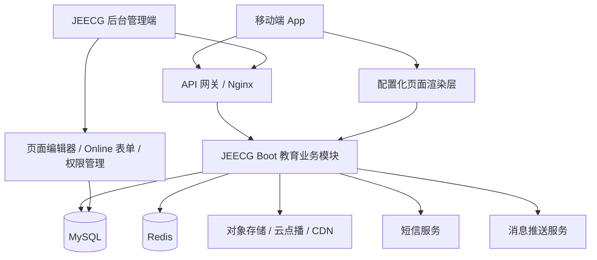

# 技术架构与选型建议

## 1. 总体架构

首期建议采用单体部署 + 模块化开发。教育业务作为 `jeecg-module-edu` 独立模块接入 JEECG Boot，避免过早拆微服务。等课程访问量、视频播放量、消息发送量上来后，再拆分内容服务、学习服务、消息服务。

## 2. 后端选型

| 方向 | 建议 |
| --- | --- |
| 基础框架 | JEECG Boot Spring Boot 3 分支 |
| 业务模块 | 新建 `jeecg-module-edu`，集中放课程、课节、学习进度、信息、页面配置 |
| 权限认证 | 复用 JEECG Token、角色、菜单、按钮权限；移动端使用同一认证体系扩展 App API |
| 数据库 | MySQL 8.0，首期单库 |
| ORM | MyBatis-Plus，遵循 JEECG 生成代码风格 |
| 缓存 | Redis：Token/Session、验证码、页面配置缓存、课程详情缓存 |
| API 文档 | 使用 JEECG/SpringDoc 或 Knife4j 生成接口文档 |
| 文件存储 | 对象存储 OSS/COS + CDN |
| 视频服务 | 云点播优先，后端管理视频 ID、播放地址、封面、时长和授权 |
| 定时任务 | 首期可用 JEECG 内置定时任务或 XXL-JOB，处理消息定时发送、课程上下架 |

JEECG 官方文档显示其当前技术栈包含 Spring Boot 3.5、Spring Cloud Alibaba、MyBatis-Plus、Vue3.5、Vite6、Ant Design Vue4，并提供细粒度权限、Online 表单、表单设计、门户设计等能力。首期应优先利用这些能力做后台 CRUD 和权限控制。

## 3. 前端选型

### 3.1 移动端

推荐优先级：

| 方案 | 优点 | 风险 | 适用建议 |
| --- | --- | --- | --- |
| UniApp + Vue3 | 与 JEECG APP 生态和 Vue 技术栈接近，H5/小程序/App 复用度高 | 原生视频体验和复杂交互动效需要专项验证 | 首期推荐 |
| Flutter | 跨端 UI 一致性好，播放器体验可控 | 与 JEECG/Vue 生态割裂，团队学习成本高 | 团队已有 Flutter 能力时可选 |
| React Native | 生态成熟，原生能力较强 | 与 JEECG/Vue 生态割裂，依赖管理复杂 | 团队已有 RN 能力时可选 |
| H5 + App 壳 | 开发最快，热更新方便 | 视频、缓存、推送、性能体验弱 | 原型期或内部试点可用 |

由于用户已说明“前端由我负责开发”，本文接口和页面配置方案会保持前端框架中立，但推荐首期使用 UniApp/Vue3。

### 3.2 后台管理端

后台管理端沿用 JEECG Vue3 管理端：

- 常规 CRUD 页面通过 JEECG Online 表单/代码生成快速生成。
- 复杂业务操作如课程发布、视频绑定、授权管理，采用代码生成后手工扩展。
- 页面编辑器采用 JEECG 门户设计/页面设计能力或在 JEECG 后台中扩展自定义编辑器。

## 4. 视频方案

不建议把视频文件直接放在应用服务器目录，也不建议让 JEECG 后端直接承担大文件流媒体分发。推荐：

1. 后台上传视频到云点播或对象存储。
2. 云服务完成转码、截图、时长识别、CDN 分发。
3. 后端保存 `videoId`、播放地址、封面、时长、转码状态。
4. App 请求课节播放信息。
5. 后端根据课程授权返回临时播放地址或播放凭证。

首期最小实现可以先使用对象存储直链 + 防盗链配置；正式生产建议使用云点播，便于转码、加密、防盗链和播放统计。

## 5. 页面配置渲染方案

后台页面编辑器不直接生成移动端源码，而是生成结构化 JSON schema。移动端 App 内置一个“配置化页面渲染层”，按组件白名单渲染：

- `banner`：轮播图。
- `courseList`：课程横滑/纵向列表。
- `noticeBar`：公告条。
- `infoList`：信息列表。
- `imageNav`：图标导航。
- `topicCard`：专题卡片。
- `richText`：富文本。
- `spacer`：间距。

这样既满足非技术人员拖拽改 UI，又避免生产 App 执行任意 HTML/CSS/JS 带来的安全和兼容风险。

## 6. 数据一致性与缓存策略

| 数据 | 缓存建议 | 失效策略 |
| --- | --- | --- |
| 首页发布 schema | Redis + App 本地缓存 | 页面发布后刷新 Redis，App 按版本号更新 |
| 课程详情 | Redis 短缓存 | 课程保存/上下架后清理 |
| 信息列表 | Redis 短缓存 | 信息发布/下线后清理 |
| 视频播放凭证 | Redis 或云服务短期 token | 过期自动重新申请 |
| 用户学习进度 | 不建议强依赖缓存 | 直接入库，必要时批量上报 |

页面配置必须以数据库为准。Redis 只做加速，不能作为唯一存储。

## 7. 部署建议

### 7.1 测试环境

- 1 台应用服务器：JEECG 后端 + 后台前端。
- 1 个 MySQL 实例。
- 1 个 Redis 实例。
- 1 个对象存储 Bucket。
- Nginx 代理后台、App API、静态资源。

### 7.2 生产环境

- Nginx/API 网关单独部署。
- JEECG 后端至少 2 个实例，便于滚动发布。
- MySQL 开启定期备份。
- Redis 开启持久化和密码。
- OSS/COS + CDN 承载图片和视频。
- 日志接入 ELK、Loki 或云日志。

## 8. 安全建议

- 所有 App API 使用 HTTPS。
- Token 不在 URL 中传递，特殊场景如视频播放凭证使用短期 token。
- 富文本内容做 XSS 过滤。
- 页面配置只允许白名单组件和白名单样式 token，不允许任意 JS。
- 文件上传校验类型、大小和扩展名。
- 后台页面配置发布权限单独授权，避免普通运营误发布。

